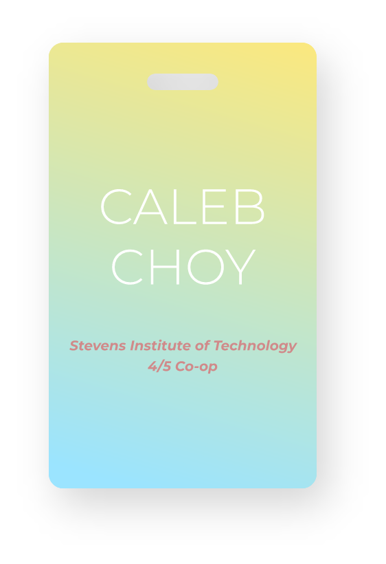

### Hi there 👋

 
 
 
I like experimenting with cool features and exploring what is possible

- 🐍 python
- ☕ javascript, java
- 🌊 c, c++
- 📈 node.js
- 🕸 html, css
- 🐼 pandas
- 🐫 oCaml

[LinkedIn](https://www.linkedin.com/in/caleb-choy-742869155)
<!--
**Ookayleb/Ookayleb** is a ✨ _special_ ✨ repository because its `README.md` (this file) appears on your GitHub profile.

Here are some ideas to get you started:

- 🔭 I’m currently working on ...
- 🌱 I’m currently learning ...
- 👯 I’m looking to collaborate on ...
- 🤔 I’m looking for help with ...
- 💬 Ask me about ...
- 📫 How to reach me: ...
- 😄 Pronouns: ...
- ⚡ Fun fact: ...
-->
